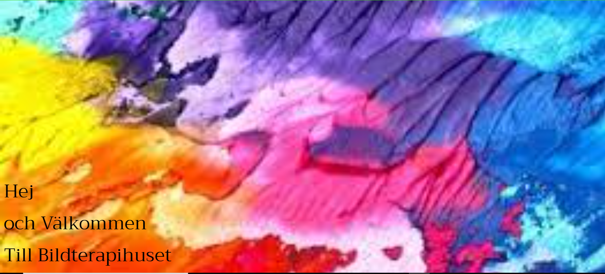
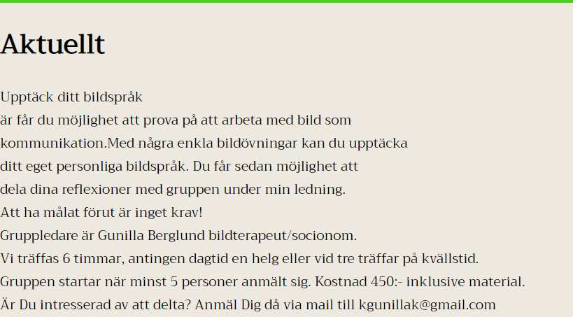

## Nizar Dawood 2022-03-19

## Inledning
under de senaste veckorna har vi arbetat med att göra om en hemsida av en figma skiss.
uppgiften är att redesigna en webbplats. Ett samarbete med kursen Digitalt skapande för arbete med layout, design och logotyper med utgångspunkt i mobile first.
syfte är att träna på de olika kunskaper som vi har fått under höst terminen och utväckla våra kunskaper.

## Bakgrund
under det här arbete behövde vi inte göra en redesigna eftersom vi hade redan gjort det på digitalskapande där vi fick skissa på papper hur hemsidan skulle se utt och sedan fick designa det på figma.

1.jag började med att koda start sidans nav bar med länkar till andra fönster i hemsidan

2.lägde till containrar och classer 

3.la till bilder och text

4.fixa css
här är två blider på problem jag stöte på bild upplösning och strukterea stormängd text 

'''

'''

## Negativa erfarenheter

 anpassa efter  skärm storleken.

tydligare planering.

börja med mobile first.

hantera text så att det inte kraschar.

## Positiva erfarenheter

jag har lät mig hur man använder mediaquaries

länka en fönster till hemsidan

lägga till en nav bar

lättare att skriva koden

## Sammanfattning

över lag gick det bra och jag har lärt mig hur man använder mediaquaries
mer säker på html grunderna. till nästa gång behöver jag göra en tydligare planering och börja med mobile first och börja med att lägga in text.
För att förbättra den här hemsidan så behöver jag fixa nav baren till en meny så att det går att använda på mobil.lägg inbilder 

